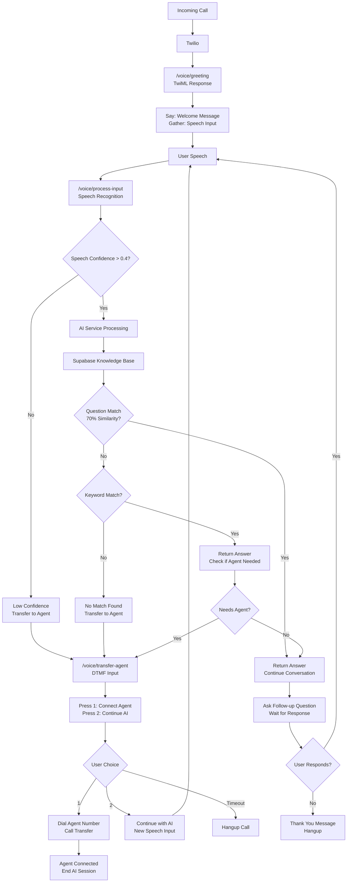

# InstaCall Voice Agent

A simple and focused Node.js voice agent built with Twilio TwiML for automated customer support calls.

## 🚀 Features

- **Knowledge Base** - Supabase-powered question and keyword matching
- **Agent Transfer** - Seamless handoff to human agents
- **24/7 Support** - Always available voice assistant
- **3-Tier Matching** - Questions → Keywords → Agent Transfer

## 📁 Project Structure

```
instacall/
├── src/
│   ├── config/           # Configuration
│   │   ├── index.js      # Unified config (environment + constants)
│   │   └── supabase.js   # Supabase client setup
│   ├── controllers/      # Request handlers
│   │   └── voiceController.js # Voice endpoints (greeting, process-input, transfer-agent)
│   ├── middleware/       # Express middleware
│   │   ├── errorHandler.js    # Global error handling
│   │   ├── requestLogger.js   # HTTP request logging
│   │   └── validateTwilio.js  # Twilio webhook validation
│   ├── routes/          # API routes
│   │   └── voice.js     # Voice endpoint routes
│   ├── services/        # Business logic
│   │   ├── aiService.js # Speech processing & matching logic
│   │   └── knowledgeBaseService.js # Supabase database integration
│   └── utils/           # Utilities
│       ├── logger.js    # Structured logging (call, speech, transfer)
│       └── twimlGenerator.js # TwiML XML response templates
├── index.js             # Application entry point & server setup
├── package.json         # Dependencies & scripts
├── package-lock.json    # Locked dependency versions
├── .env.example         # Environment variables template
├── .gitignore          # Git ignore patterns
└── README.md           # Project documentation
```

## 🛠 Installation

1. **Clone and install dependencies:**
   ```bash
   npm install
   ```

2. **Set up environment variables:**
   ```bash
   cp .env.example .env
   # Edit .env with your configuration
   ```

3. **Start the development server:**
   ```bash
   npm run dev
   ```

## 🌍 Environment Variables

| Variable | Description | Default | Required |
|----------|-------------|---------|----------|
| `PORT` | Server port | `5000` | No |
| `NODE_ENV` | Environment | `development` | No |
| `TWILIO_AUTH_TOKEN` | Twilio auth token | - | Production |
| `TWILIO_ACCOUNT_SID` | Twilio account SID | - | No |
| `AGENT_PHONE_NUMBER` | Agent transfer number | `+1234567890` | No |
| `SUPABASE_URL` | Supabase project URL | - | Yes |
| `SUPABASE_ANON_KEY` | Supabase anon key | - | Yes |
| `CORS_ORIGIN` | CORS origin | `*` | No |

## 📞 API Endpoints

### Voice Endpoints (TwiML)
- `POST /voice/greeting` - Entry point for incoming calls
- `POST /voice/process-input` - Speech processing with Supabase knowledge base
- `POST /voice/transfer-agent` - Agent transfer or continue with AI

### Information Endpoints (JSON)
- `GET /` - API welcome message
- `GET /health` - Health check with system info
- `GET /api/info` - API information and features

## 🔧 Setup Instructions

### 1. Supabase Setup
1. Create project at [supabase.com](https://supabase.com)
2. Run `supabase_knowledge_base.sql` in SQL Editor
3. Get URL and anon key from Settings → API
4. Configure knowledge base at [Knowledge Base Manager](https://knowledgebasevoice.netlify.app/)

### 2. Twilio Configuration
1. Set webhook URL to: `https://your-domain.com/voice/greeting`
2. Enable Speech Recognition add-on
3. Get Auth Token from Twilio Console

### 3. Environment Setup
```bash
cp .env.example .env
# Edit .env with your credentials
```

## 📋 Call Flow Architecture

### 🏗️ System Architecture Diagram

The following diagram shows the complete voice agent flow from incoming call to response:



### 🔄 Flow Summary

1. **Incoming Call** → `/voice/greeting` → Collect speech input
2. **Speech Processing** → `/voice/process-input` → Query Supabase knowledge base
3. **Smart Matching** → Questions (70% similarity) → Keywords → Agent transfer
4. **Response** → AI answer OR agent connection via `/voice/transfer-agent`

## 🔒 Security

- **Environment Variables** - Secure credential storage

## 🚀 Development

**Scripts:**
- `npm run dev` - Start with nodemon
- `npm start` - Production server

**Logging:**
- **Call Logs** - Incoming calls with metadata
- **Speech Logs** - Speech recognition results  
- **Transfer Logs** - Agent transfer requests

## 🧠 Knowledge Base

### 📊 Knowledge Base Structure
- **Smart Matching** - 70% similarity threshold for questions
- **Keyword Fallback** - Exact keyword matching
- **Agent Transfer** - Auto-transfer for technical/urgent/support topics

### 🔧 Knowledge Base Configuration

You can manage and configure your knowledge base using our web interface:

**🌐 [Knowledge Base Manager](https://knowledgebasevoice.netlify.app/)**

Features available in the web interface:
- ✅ **Add/Edit Questions** - Manage predefined questions for each topic
- ✅ **Keyword Management** - Configure fallback keywords 
- ✅ **Answer Templates** - Create and edit response templates
- ✅ **Testing Interface** - Test your knowledge base matching

**Note:** After updating your knowledge base through the web interface, the changes will automatically sync with your Supabase database and be available to your voice agent immediately.

## 📝 License

ISC

## 👤 Author

sam

---

**InstaCall** - AI-powered voice assistant for automated customer support